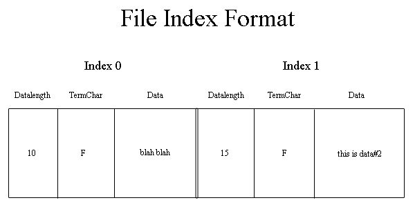



## File Index

### Description

This Class puts files and string into a bigger file. Like an array. But when it inserts (or extracts) a file it doesnt use large amounts of memory and CPU. It grabs small chunks of the file in opposition to loading the entire file into memory. Loading many files that are large in size will use up memory and CPU. It doesnt use encryption or compression, but you could add those. Feel free to use this code in any manner, and I hope you have a good day.
 
### More Info
 

             |
---                |---
**Submitted On**   |2006-04-08 09:55:40
**By**             |[Evil\_Bob](https://github.com/Planet-Source-Code/PSCIndex/blob/master/ByAuthor/evil-bob.md)
**Level**          |Intermediate
**User Rating**    |5.0 (20 globes from 4 users)
**Compatibility**  |VB 6\.0
**Category**       |[Files/ File Controls/ Input/ Output](https://github.com/Planet-Source-Code/PSCIndex/blob/master/ByCategory/files-file-controls-input-output__1-3.md)
**World**          |[Visual Basic](https://github.com/Planet-Source-Code/PSCIndex/blob/master/ByWorld/visual-basic.md)
**Archive File**   |[File\_Index198588482006\.zip](https://github.com/Planet-Source-Code/evil-bob-file-index__1-64959/archive/master.zip)

